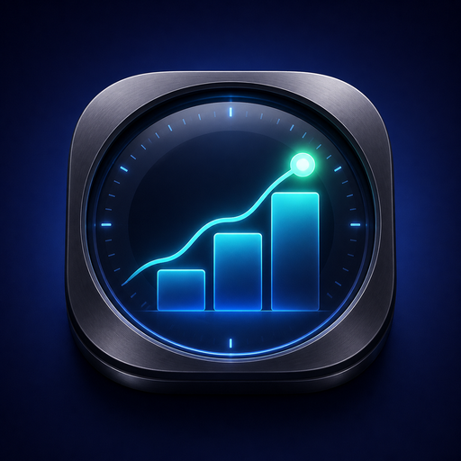
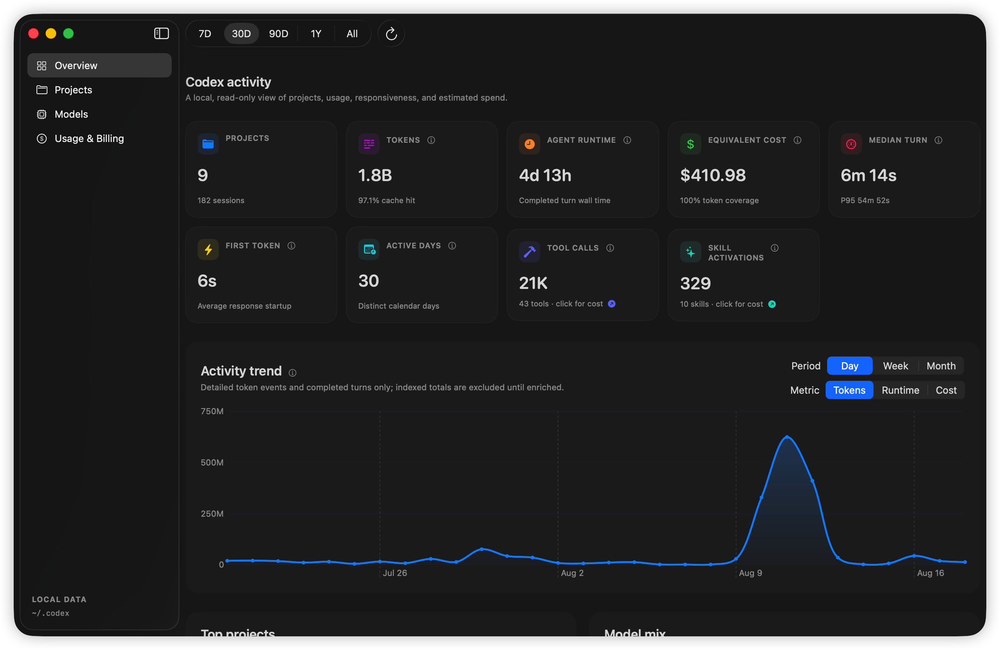
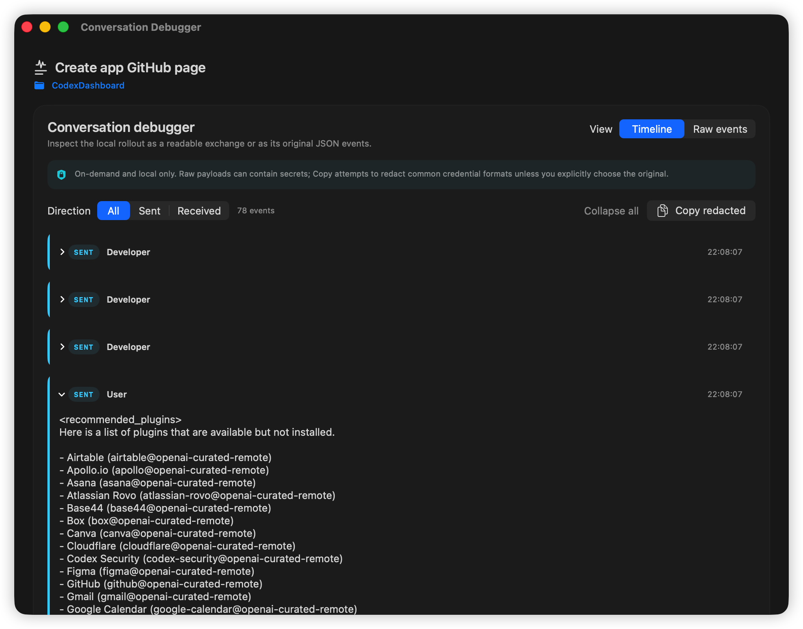
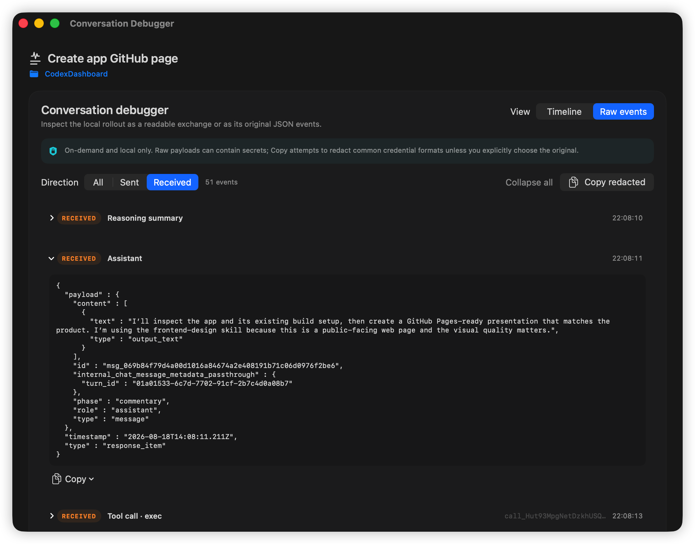
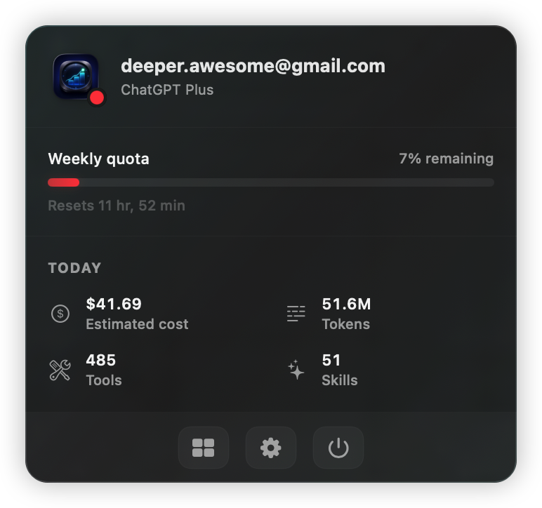
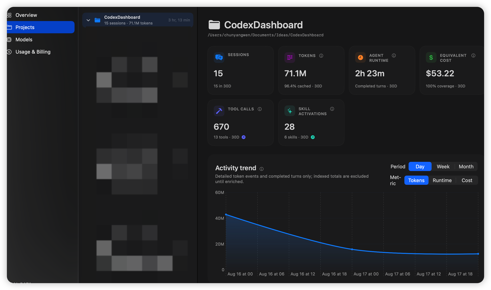
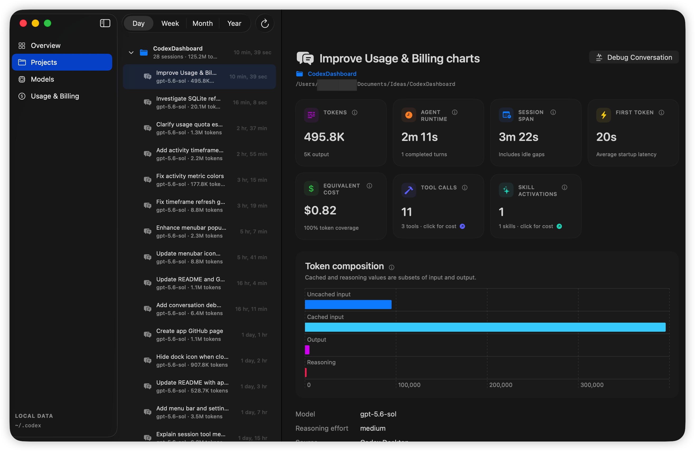
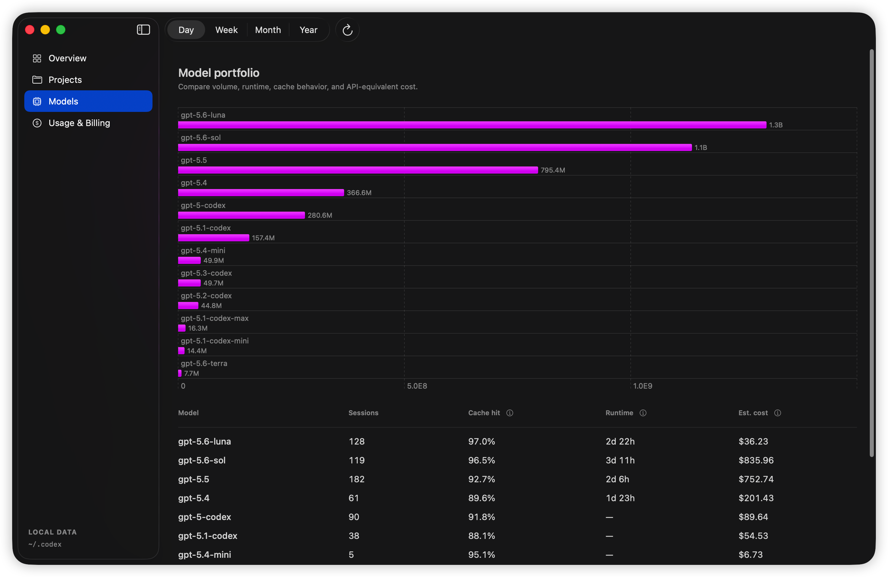
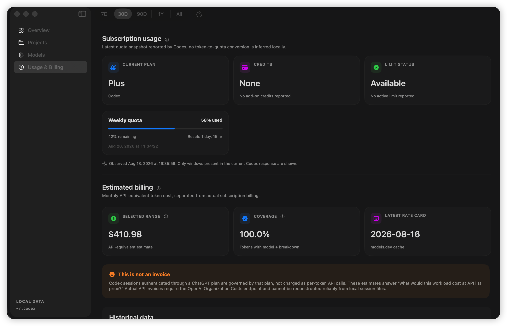

<div align="center">
  
  <h1>Codex Dashboard</h1>
  <p>A private, local-first macOS dashboard for understanding how you use Codex.</p>
  <p>Explore activity by project, session, model, time, tokens, tools, skills, and API-equivalent cost—without sending your session data anywhere.</p>
  <p><a href="https://chunyang-wen.github.io/CodexDashboard/"><strong>View the website →</strong></a></p>
</div>



## See what Codex actually exchanged

Open **Debug Conversation** from any session to inspect its local rollout in a separate window. The readable timeline puts user and assistant messages, reasoning summaries, tool calls, and tool results in order; **Raw events** exposes the original JSON when you need to understand the protocol itself. Filter by sent or received events, expand only what matters, and copy a single event or the filtered conversation with common credential formats redacted by default.



<details>
  <summary><strong>See the original JSON events</strong></summary>
  <br>

  
</details>

The debugger is deliberately on-demand: conversation payloads are read from the selected rollout only after you open the debugger, kept in memory for that window, and never added to dashboard history. Because raw payloads can still contain private data, copying is redacted by default and copying the original requires an explicit confirmation.

## What you can see

- **At-a-glance activity:** projects, sessions, tokens, cache hit rate, agent runtime, turn latency, tool calls, skill activations, and estimated spend.
- **Projects and sessions:** move from a portfolio view into a project and then an individual session, with token composition and activity trends at each level.
- **Conversation debugger:** inspect sent and received messages, reasoning summaries, tool calls, tool results, and original JSON events—with on-demand loading and redacted copying by default.
- **Model portfolio:** compare usage volume, runtime, cache behavior, session count, and API-equivalent cost across models.
- **Subscription usage:** see the latest plan, quota windows, reset times, credits, and limit status reported by Codex.
- **Historical analysis:** switch between 7 days, 30 days, 90 days, one year, or all history, with daily, weekly, and monthly charts.
- **Menu-bar quota marker:** check remaining quota and place a draggable alert marker at the percentage you want to preserve. The threshold also appears in the menu-bar icon, alongside quick access to today's tokens, tool calls, skill activations, and estimated cost.
- **Command-line access:** query the same local data from scripts and export session metrics as JSON.

## A closer look

<table>
  <tr>
    <td width="34%" valign="top">
      
      <br><strong>Menu bar</strong><br>
      Track remaining quota and drag the alert marker to the threshold you want to preserve—without leaving the menu bar.
    </td>
    <td width="66%" valign="top">
      
      <br><strong>Projects</strong><br>
      Compare workspaces, expand their sessions, and inspect activity over time.
    </td>
  </tr>
</table>

<details>
  <summary><strong>More screenshots</strong></summary>
  <br>

  ### Session detail

  Inspect tokens, runtime, session span, first-token latency, tools, skills, and token composition for a single task.

  

  ### Models

  Compare the models in your local history by volume, sessions, cache hit rate, runtime, and estimated cost.

  

  ### Usage & Billing

  Keep subscription quota separate from API-equivalent cost estimates, and preserve or transfer your historical metrics.

  
</details>

## Local by design

Codex Dashboard opens `~/.codex/state_5.sqlite` read-only and enriches indexed sessions from local rollout JSONL files. It never reads authentication files, modifies `~/.codex`, uploads session content, or stores conversation text. Conversation payloads are read only when you open a selected session's **Debug Conversation** window and are kept in memory for that window.

Parsed metrics, session metadata, effective-dated price schedules, and byte checkpoints are stored in:

```text
~/Library/Application Support/CodexDashboard/metrics-v1.sqlite
```

The only routine network request is an anonymous pricing-catalog download from `https://models.dev/api.json`. It contains no local metrics or identifiers. A validated response is cached locally; bundled prices remain available offline.

While the app is open, its persistent menubar host owns one recursive macOS FSEvents subscription for changes under the Codex data directory; the app does not periodically poll every known rollout. Events are coalesced using the configured refresh interval, and the durable filesystem-journal cursor lets normal reopening resume without an inventory sweep. This keeps today's cost and quota-derived metrics current even when the dashboard window is closed. An all-session reconciliation is reserved for first-time watcher migration or when macOS reports dropped or expired journal events. Refresh pauses in Low Power Mode or under serious thermal pressure, retries unacknowledged changes with backoff, and stops when the app quits. Append-only logs resume from the last complete newline instead of being scanned again from the beginning. Quota snapshots are extracted during that same incremental pass and cached, avoiding a second scan of recent rollout tails.

## Run from source

Requirements:

- macOS 14 or later
- A Swift 6.1-compatible Xcode toolchain
- Local Codex activity in `~/.codex`, or another folder selected in Settings

Clone the repository and run the native SwiftUI app:

```bash
swift run CodexDashboard
```

Or open `CodexDashboard.xcodeproj`, choose the shared **CodexDashboard** scheme, and press Run. The Xcode project also includes the **CodexMetricsCLI** scheme and the `CodexMetricsCoreTests` test target. `Package.swift` and the Xcode project reference the same sources.

On first launch, indexed metrics appear immediately while detailed timings and token breakdowns are enriched for the selected date range. Use **Usage & Billing → Scan All History** once if you want to preserve every rollout currently available.

## CLI

The bundled `codex-metrics` executable supports summaries, projects, sessions, models, time periods, subscription state, and JSON export:

```bash
swift run codex-metrics summary
swift run codex-metrics periods --by month --enrich
swift run codex-metrics sessions --project CodexDashboard --enrich
swift run codex-metrics export --output codex-metrics.json
```

Useful options include `--codex-home PATH`, `--project TEXT`, `--limit NUMBER`, `--by day|week|month`, and `--enrich`. The CLI is index-only by default; pass `--enrich` when you need rollout-derived timings and token breakdowns.

## Understanding the numbers

Three distinctions matter most:

- **Agent runtime** is the sum of completed Codex turn durations. **Session span** runs from creation to the last update and includes idle gaps.
- **Cached input** is already part of input tokens, and **reasoning output** is already part of output tokens; neither is added again to the total.
- **Estimated cost** answers “what would this workload cost at API list price?” It is not a ChatGPT subscription charge or an OpenAI invoice. Coverage is shown beside the estimate because a price requires both a detailed token breakdown and a recognized model.
- In **Usage & Billing**, Day, Week, Month, and Year show the estimate for the current calendar period to date. The history chart and table use the same daily, weekly, monthly, or yearly grouping across retained usage.

See [METRICS.md](METRICS.md) for calculations, attribution rules, pricing limitations, and period semantics.

## Historical data

The durable history database survives source-log removal and parser-cache invalidation. Export and import from **Usage & Billing** create a portable JSON archive containing aggregate metric events, session metadata, and effective-dated price schedules—never conversation content or credentials.

Existing `rollouts-v4.json` and `history-v1.json` data is migrated automatically. Pricing changes create new schedules rather than rewriting earlier estimates.

## Roadmap

- Opt-in OpenAI Organization Costs integration, keeping actual API spend separate from local-folder attribution
- User pricing overrides and a signed first-party pricing source if OpenAI exposes one
- CSV export, budgets, anomaly detection, and menu-bar weekly summaries
- Signed, sandbox-aware distribution with user-selected Codex-directory access
